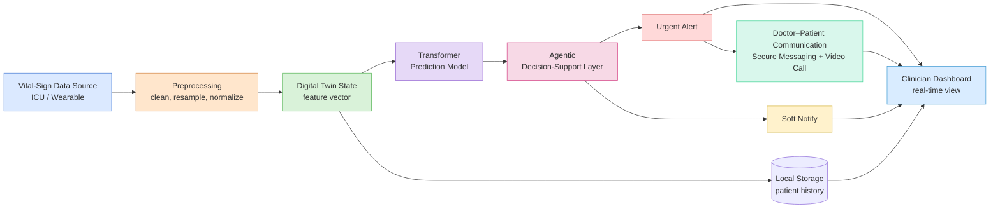

# Major_Project-PR1107
# HealthTwin : Digital Twin for Remote Patient Monitoring

Major Project (PR1107), B.Tech CSAI, JK Lakshmipat University
**Prepared by:** Priyanshi Mehta (2023BTech061)
**Faculty Guide:** Dr. Amit Sinhal

## Objective

HealthTwin is a digital twin system for predictive remote patient monitoring.
It builds a continuously updated virtual model of a patient's vitals, uses a
Transformer-based model to predict deterioration risk hours in advance, and
raises alerts only when genuinely warranted reducing false alarms while
giving doctors a direct communication channel to reach the patient when
needed.

## System Flow Diagram

## Literature Review

| Paper | Focus | Link |
|---|---|---|
| Reyna et al. (2020) — Early Prediction of Sepsis From Clinical Data | Core dataset + prediction task | [PDF](https://physionet.org/files/challenge-2019/1.0.0/physionet_challenge_2019_ccm_manuscript.pdf) |
| Enhancing the resilience of RPM and hospital-at-home systems (2026) | Digital twin framework for remote patient monitoring | [Link](https://www.nature.com/articles/s44401-026-00109-9) |
| Digital twins in healthcare: a comprehensive review and future directions | General background on digital twins in healthcare | [Link](https://pmc.ncbi.nlm.nih.gov/articles/PMC12671388/) |
| A comprehensive review of digital twin in healthcare (simulative health-monitoring) | Health-monitoring-specific digital twin review | [Link](https://pmc.ncbi.nlm.nih.gov/articles/PMC11705329/) |
| Jameil & Al-Raweshidy — A Digital Twin Framework for Real-Time Healthcare Monitoring | Digital twin + ML (MLP/XGBoost) on MIMIC-III, closest methodological match | [PDF](https://bura.brunel.ac.uk/bitstream/2438/31182/3/FullText.pdf) |
| Enhancing Healthcare through Sensor-Enabled Digital Twins in Smart Environments | IoT + ML + telemedicine/remote-monitoring | [Link](https://pmc.ncbi.nlm.nih.gov/articles/PMC11086215/) |

## Dataset

**Source:** [PhysioNet/CinC 2019 Sepsis Challenge](https://physionet.org/content/challenge-2019/1.0.0/)

40,336 ICU patients (`training_setA` + `training_setB`), combined into 42-column
hourly records. Full dataset is in [`dataset/healthtwin_sepsis_data/`](dataset/healthtwin_sepsis_data/)
