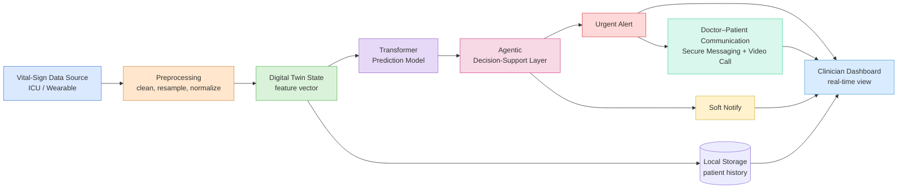

# Major_Project-PR1107
# HealthTwin : Digital Twin for Remote Patient Monitoring

Major Project (PR1107), B.Tech CSAI, JK Lakshmipat University
**Prepared by:** Priyanshi Mehta (2023BTech061)
**Faculty Guide:** Dr. Amit Sinhal

## Objective

HealthTwin is a digital twin system for predictive remote patient monitoring.
It builds a continuously updated virtual model of a patient's vitals, uses a
Transformer-based model to predict sepsis risk hours in advance, and raises
alerts only when genuinely warranted, reducing false alarms while giving
doctors a direct communication channel to reach the patient when needed.

## System Flow Diagram


```mermaid
flowchart LR
    A[Vital-Sign Data Source<br/>ICU / Wearable] --> B[Preprocessing<br/>clean, resample, normalize]
    B --> C[Digital Twin State<br/>feature vector]
    C --> D[Transformer<br/>Prediction Model]
    D --> E[Agentic<br/>Decision-Support Layer]
    C --> F[(Local Storage<br/>patient history)]
    E --> G[Urgent Alert]
    E --> H[Soft Notify]
    G --> I[Clinician Dashboard<br/>real-time view]
    H --> I
    F --> I
    G --> J[Doctor–Patient Communication<br/>Secure Messaging + Video Call]
    J --> I

    style A fill:#dbe9ff,stroke:#4a7fd6
    style B fill:#ffe6cc,stroke:#d68a4a
    style C fill:#d9f2d9,stroke:#5cb85c
    style D fill:#e6d9f7,stroke:#9b6ed6
    style E fill:#f7d9e6,stroke:#d64a8a
    style G fill:#ffd9d9,stroke:#d64a4a
    style H fill:#fff2cc,stroke:#d6b84a
    style I fill:#d9ecff,stroke:#4a9fd6
    style J fill:#d9f7ec,stroke:#4ad69b
```

## Dataset

Sourced from the [PhysioNet/CinC 2019 Sepsis Challenge](https://physionet.org/content/challenge-2019/1.0.0/).
40,336 ICU patients, 1,552,210 hourly records, 73 features per hour after preprocessing.

## Method

1. Combine all patient files and split by patient (80% train / 20% test).
2. Add missing-value flags, forward-fill per patient, fill the rest with training medians, scale with a scaler fitted on training data only.
3. Build one 60 x 73 sequence per patient (first 60 ICU hours, padded and masked).
4. Train a causal Transformer encoder (PyTorch) that gives a sepsis risk score for every hour.
5. A decision agent turns the score into Stable (below 0.50), Soft Notify (0.50 to 0.70) or Urgent Alert (0.70 and above).
6. A Streamlit dashboard shows the ICU overview, patient risk trend, alert history, messaging and a Jitsi video link.

## Results

| Metric | Value |
|---|---|
| AUROC (8,068 unseen test patients) | 0.78 |
| Precision / Recall at 0.50 | 0.044 / 0.493 |
| Precision / Recall at 0.70 | 0.064 / 0.294 |
| Patients given an early warning | 209 of 383 |
| Median early-warning lead time | 16 hours |

## How to Run

```bash
git clone https://github.com/priyanshi139/Major_Project-PR1107-.git
cd Major_Project-PR1107-
git lfs install && git lfs pull
pip install -r app/requirements.txt
cd app && streamlit run app.py
```

The full pipeline (data download, preprocessing, training, evaluation) is in `Major.ipynb` and runs on Google Colab.

## Repository Structure

```text
dataset/healthtwin_sepsis_data/   raw_data/ and preprocessed/ (Git LFS)
src/                              sequence builder and training code
app/                              Streamlit dashboard, agent, communication, trained model
Major.ipynb                       full pipeline
```

## Literature Review

| Paper | Focus | Link |
|---|---|---|
| Reyna et al. (2020) — Early Prediction of Sepsis From Clinical Data | Core dataset + prediction task | [PDF](https://physionet.org/files/challenge-2019/1.0.0/physionet_challenge_2019_ccm_manuscript.pdf) |
| Enhancing the resilience of RPM and hospital-at-home systems (2026) | Digital twin framework for remote patient monitoring | [Link](https://www.nature.com/articles/s44401-026-00109-9) |
| Digital twins in healthcare: a comprehensive review and future directions | General background on digital twins in healthcare | [Link](https://pmc.ncbi.nlm.nih.gov/articles/PMC12671388/) |
| A comprehensive review of digital twin in healthcare (simulative health-monitoring) | Health-monitoring-specific digital twin review | [Link](https://pmc.ncbi.nlm.nih.gov/articles/PMC11705329/) |
| Jameil & Al-Raweshidy — A Digital Twin Framework for Real-Time Healthcare Monitoring | Digital twin + ML (MLP/XGBoost) on MIMIC-III, closest methodological match | [PDF](https://bura.brunel.ac.uk/bitstream/2438/31182/3/FullText.pdf) |
| Enhancing Healthcare through Sensor-Enabled Digital Twins in Smart Environments | IoT + ML + telemedicine/remote-monitoring | [Link](https://pmc.ncbi.nlm.nih.gov/articles/PMC11086215/) |
