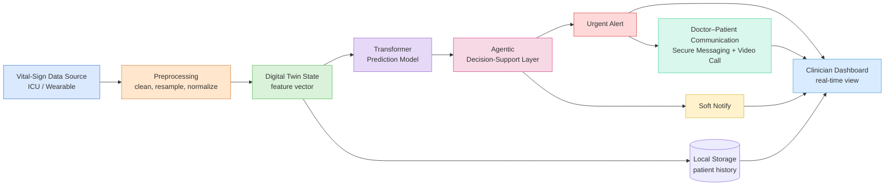
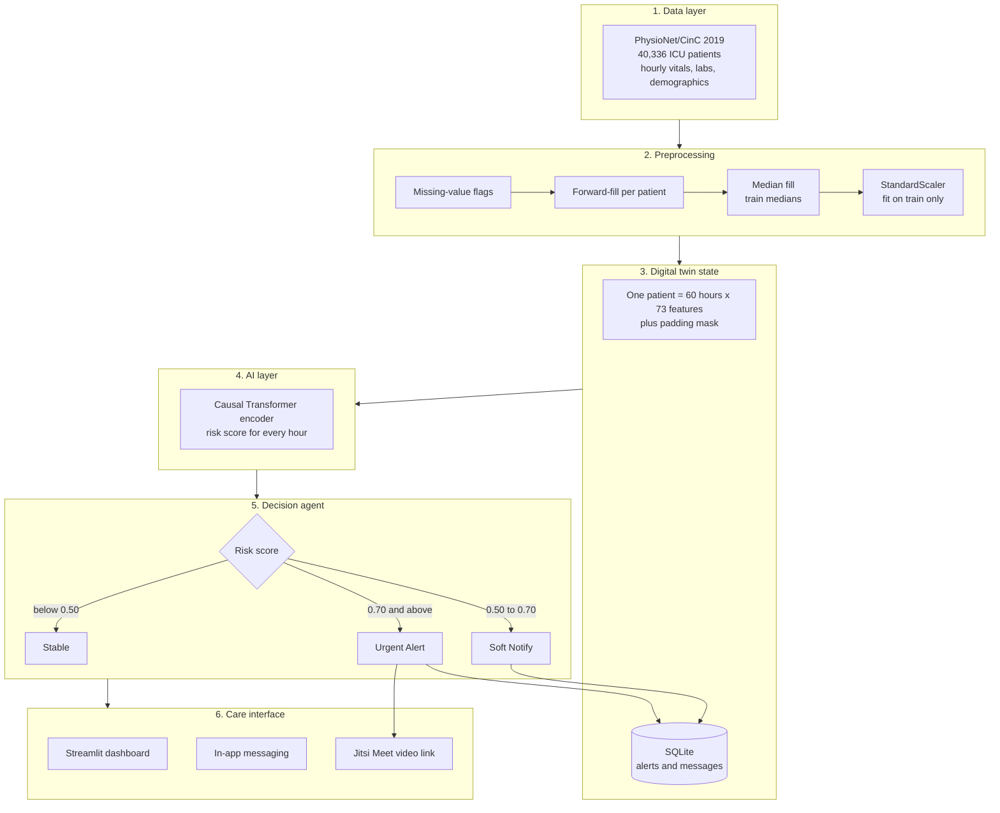
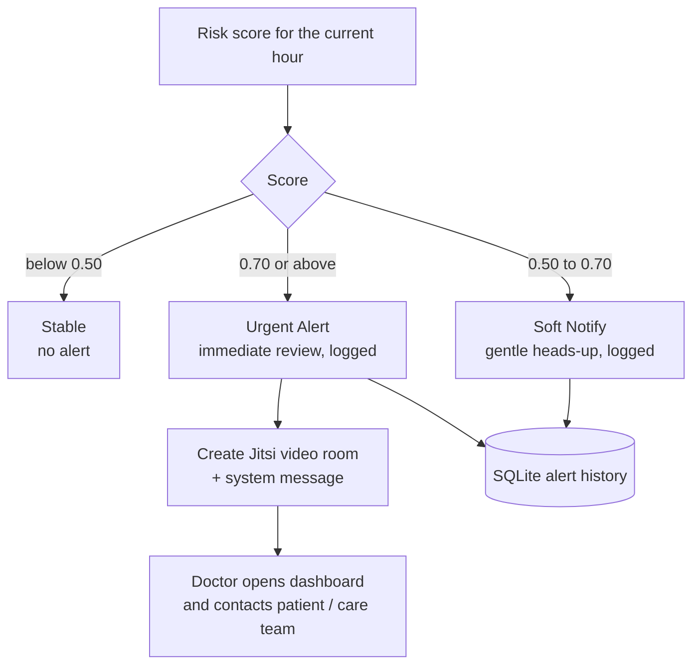

# Major_Project-PR1107
# HealthTwin : Digital Twin for Remote Patient Monitoring

Major Project (PR1107), B.Tech CSAI, JK Lakshmipat University
**Prepared by:** Priyanshi Mehta (2023BTech061)
**Faculty Guide:** Dr. Amit Sinhal

## Objective

HealthTwin is a digital twin system for predictive remote patient monitoring.
It builds a continuously updated virtual model of a patient's vitals, uses a
Transformer-based model to predict sepsis risk hours in advance, and raises
alerts only when genuinely warranted, reducing false alarms while giving
doctors a direct communication channel to reach the patient when needed.

## Problem and Why Sepsis

ICU staff cannot watch every patient every minute, and fixed-limit alarms (for
example HR > 120) are mostly false, which causes alarm fatigue. Sepsis is a
time-critical condition where early detection matters, and its early signs
are subtle patterns across several vitals over several hours, which a
time-series model can learn but a single threshold cannot.

## Key Results

| Metric | Value |
|---|---|
| AUROC (8,068 unseen test patients) | 0.78 |
| Precision / Recall at threshold 0.50 | 0.044 / 0.493 |
| Precision / Recall at threshold 0.70 | 0.064 / 0.294 |
| Septic patients in test set | 551 |
| Onset inside the 60-hour window | 383 |
| Given an early warning (score >= 0.50 before onset) | 209 (about 55%) |
| Median / mean early-warning lead time | 16.0 h / 20.4 h |

A first bidirectional model reached an AUROC of 0.96 because it could see
future hours (information leakage). A causal attention mask fixed this and
gave the realistic AUROC of 0.78 reported above.

## System Flow Diagram


```mermaid
flowchart LR
    A[Vital-Sign Data Source<br/>ICU / Wearable] --> B[Preprocessing<br/>clean, resample, normalize]
    B --> C[Digital Twin State<br/>feature vector]
    C --> D[Transformer<br/>Prediction Model]
    D --> E[Agentic<br/>Decision-Support Layer]
    C --> F[(Local Storage<br/>patient history)]
    E --> G[Urgent Alert]
    E --> H[Soft Notify]
    G --> I[Clinician Dashboard<br/>real-time view]
    H --> I
    F --> I
    G --> J[Doctor–Patient Communication<br/>Secure Messaging + Video Call]
    J --> I

    style A fill:#dbe9ff,stroke:#4a7fd6
    style B fill:#ffe6cc,stroke:#d68a4a
    style C fill:#d9f2d9,stroke:#5cb85c
    style D fill:#e6d9f7,stroke:#9b6ed6
    style E fill:#f7d9e6,stroke:#d64a8a
    style G fill:#ffd9d9,stroke:#d64a4a
    style H fill:#fff2cc,stroke:#d6b84a
    style I fill:#d9ecff,stroke:#4a9fd6
    style J fill:#d9f7ec,stroke:#4ad69b
```

## Architecture


```mermaid
flowchart TB
    subgraph L1[1. Data layer]
        D1[PhysioNet/CinC 2019<br/>40,336 ICU patients<br/>hourly vitals, labs, demographics]
    end
    subgraph L2[2. Preprocessing]
        P1[Missing-value flags] --> P2[Forward-fill per patient] --> P3[Median fill<br/>train medians] --> P4[StandardScaler<br/>fit on train only]
    end
    subgraph L3[3. Digital twin state]
        T1[One patient = 60 hours x 73 features<br/>plus padding mask]
        T2[(SQLite<br/>alerts and messages)]
    end
    subgraph L4[4. AI layer]
        M1[Causal Transformer encoder<br/>risk score for every hour]
    end
    subgraph L5[5. Decision agent]
        A1{Risk score}
        A1 -->|below 0.50| A2[Stable]
        A1 -->|0.50 to 0.70| A3[Soft Notify]
        A1 -->|0.70 and above| A4[Urgent Alert]
    end
    subgraph L6[6. Care interface]
        U1[Streamlit dashboard]
        U2[In-app messaging]
        U3[Jitsi Meet video link]
    end
    L1 --> L2 --> L3 --> L4 --> L5 --> L6
    A3 --> T2
    A4 --> T2
    A4 --> U3
```

## Dataset

Sourced from the [PhysioNet/CinC 2019 Sepsis Challenge](https://physionet.org/content/challenge-2019/1.0.0/).

| Item | Value |
|---|---|
| Patients (training sets A + B) | 40,336 |
| Hourly records | 1,552,210 |
| Original columns | 42 (40 clinical features + `SepsisLabel` + `PatientID`) |
| Features after preprocessing | 73 per hour |
| Positive rows (train) | about 1.8% (class imbalance) |

Feature groups: vitals (HR, O2Sat, Temp, SBP, MAP, DBP, Resp), 20+ lab values,
demographics (Age, Gender, unit type), time (ICULOS, HospAdmTime), target
(`SepsisLabel`, 0 or 1 for each hour).

## Preprocessing


```mermaid
flowchart LR
    R[Raw .psv files<br/>40,336 patients] --> C[Combine into one table<br/>1,552,210 rows]
    C --> S[Split by PatientID<br/>80% train / 20% test]
    S --> F[Add 34 missing-value flags]
    F --> FF[Forward-fill<br/>within each patient]
    FF --> MF[Fill the rest with<br/>training medians]
    MF --> U[Merge Unit1 and Unit2<br/>into UnitType]
    U --> SC[StandardScaler<br/>fit on train only]
    SC --> SQ[Build 60 x 73 sequences<br/>with padding mask]
```

Key design choices:
- **Split by patient, not by row.** All hours of a patient stay on one side
  (32,268 train / 8,068 test patients), so the test set mimics new admissions.
- **No leakage from test data.** Medians and the scaler are learned from the
  training patients only.
- **Fixed-size twin state.** Each patient is the first 60 ICU hours (median
  stay is 38 hours, 95% are 58 hours or less), padded and masked when shorter.

## Model

A 2-layer Transformer encoder (PyTorch) with a **causal attention mask**: the
risk at hour *t* can only use hours up to *t*.

| Setting | Value |
|---|---|
| Input | 73 features x 60 hours |
| Output | Sepsis risk for each hour |
| Loss | `BCEWithLogitsLoss`, `pos_weight` about 75.8 for class imbalance, padded hours masked out |
| Optimizer | Adam, learning rate 1e-4, gradient clipping 1.0 |
| Batch size | 32 |

Causal mask for 5 hours (1 = hour can be attended to):

| Predicting hour | h1 | h2 | h3 | h4 | h5 |
|---|---|---|---|---|---|
| h1 | 1 | 0 | 0 | 0 | 0 |
| h2 | 1 | 1 | 0 | 0 | 0 |
| h3 | 1 | 1 | 1 | 0 | 0 |
| h4 | 1 | 1 | 1 | 1 | 0 |
| h5 | 1 | 1 | 1 | 1 | 1 |

Models compared during development:

| Model | Test AUROC | Note |
|---|---|---|
| Bidirectional (no causal mask) | 0.9604 | Leaks future hours, not used |
| Causal, larger | 0.7885 | Overfits after about epoch 12 |
| Causal, small (**deployed**) | 0.7800 | Used by the agent and dashboard |

## Decision Agent and Communication


```mermaid
flowchart TD
    S[Risk score for the current hour] --> Q{Score}
    Q -->|below 0.50| N[Stable<br/>no alert]
    Q -->|0.50 to 0.70| SO[Soft Notify<br/>gentle heads-up, logged]
    Q -->|0.70 or above| UR[Urgent Alert<br/>immediate review, logged]
    UR --> V[Create Jitsi video room<br/>+ system message]
    V --> DR[Doctor opens dashboard<br/>and contacts patient / care team]
    SO --> DB[(SQLite alert history)]
    UR --> DB
```

Alerts are triggered only when the level changes, and every alert is stored in
SQLite (`healthtwin_alerts.db`). Messaging and video-call links come from
`communication.py`.

## Dashboard (Streamlit)

Modes in the sidebar: **ICU Overview** (all monitored patients), **Existing
Patient** (risk trend, current status, alert history, messaging) and
**Simulate New Patient** (enter vitals and see the risk). The twin and the
dashboard do not depend on sepsis, so other prediction models can be added later.

<!-- Add dashboard screenshots here:


-->

## Repository Structure

```text
Major_Project-PR1107-/
├── dataset/healthtwin_sepsis_data/
│   ├── raw_data/            # training_setA.zip, training_setB.zip (Git LFS)
│   └── preprocessed/        # train_preprocessed.csv, test_preprocessed.csv (Git LFS)
├── src/
│   └── sequence_modeling.py # 60 x 73 sequence builder + PyTorch Dataset
├── app/
│   ├── app.py               # Streamlit dashboard
│   ├── agent.py             # decision agent (thresholds, alert log)
│   ├── communication.py     # messaging + Jitsi video links
│   ├── requirements.txt
│   ├── sepsis_transformer_small_best.pth
│   └── scaler.pkl, train_medians.pkl, scale_cols.pkl
├── Major.ipynb              # full pipeline (Google Colab)
└── README.md
```

## How to Run

### A. Run the dashboard on your machine

```bash
git clone https://github.com/priyanshi139/Major_Project-PR1107-.git
cd Major_Project-PR1107-
git lfs install && git lfs pull        # large dataset files are stored with Git LFS
python -m venv .venv && source .venv/bin/activate    # Windows: .venv\Scripts\activate
pip install -r app/requirements.txt
cd app && streamlit run app.py
```

Then open http://localhost:8501.

### B. Reproduce the full pipeline (Google Colab, `Major.ipynb`)

1. **Get the data** (about 40k `.psv` files, `aws s3 sync` is faster and more reliable than `wget`):
   ```bash
   pip install awscli
   aws s3 sync --no-sign-request s3://physionet-open/challenge-2019/1.0.0/training/ ./healthtwin_sepsis_data/ --exclude "*" --include "*.psv"
   ```
2. **Combine and preprocess**: combine all files, split by `PatientID`, add missing flags, forward-fill, median-fill, build `UnitType`, scale (train-fitted scaler). Output: `train_preprocessed.csv`, `test_preprocessed.csv`.
3. **Build sequences**: `build_sequences(...)` gives arrays of shape (patients, 60, 73) plus masks and labels, saved as `.npy`.
4. **Train** the causal Transformer with the weighted loss and keep the best checkpoint.
5. **Pick alert thresholds** from the precision-recall table (0.50 soft, 0.70 urgent).
6. **Evaluate** AUROC, precision, recall and early-warning lead time on the test patients.
7. **Run the agent and dashboard** (`agent.py`, `communication.py`, `app.py`).

> Colab note: mount Google Drive and keep the data and model files there so that they survive session resets.

## Technology Stack

Python, Pandas, NumPy, scikit-learn, PyTorch (Transformer encoder), SQLite,
Streamlit, Jitsi Meet (video), Git LFS, Google Colab.

## Limitations

- Retrospective public data only; not a live hospital deployment.
- Precision is low because sepsis is rare (about 1.8% of rows).
- The best checkpoint and the thresholds were chosen using the test set; a
  separate validation set is needed for unbiased estimates.
- The agent has not yet been benchmarked against a plain threshold baseline.
- Alerts do not yet explain which vitals caused them.

## Future Work

| Guardrail / extension | Why |
|---|---|
| Explainable alerts | Show which vitals raised the risk |
| Human in the loop | AI suggests, doctor decides |
| Automatic data checks | Catch impossible or missing vitals before the model |
| Validation and drift monitoring | Models can fail on new hospitals |
| Privacy and access control | Encryption, role-based access, audit logs |
| Federated learning | Train across hospitals without sharing raw data |
| EHR and wearable/IoT integration, more models | Real-world use and other conditions |

## Literature Review

| Paper | Focus | Link |
|---|---|---|
| Reyna et al. (2020) — Early Prediction of Sepsis From Clinical Data | Core dataset + prediction task | [PDF](https://physionet.org/files/challenge-2019/1.0.0/physionet_challenge_2019_ccm_manuscript.pdf) |
| Enhancing the resilience of RPM and hospital-at-home systems (2026) | Digital twin framework for remote patient monitoring | [Link](https://www.nature.com/articles/s44401-026-00109-9) |
| Digital twins in healthcare: a comprehensive review and future directions | General background on digital twins in healthcare | [Link](https://pmc.ncbi.nlm.nih.gov/articles/PMC12671388/) |
| A comprehensive review of digital twin in healthcare (simulative health-monitoring) | Health-monitoring-specific digital twin review | [Link](https://pmc.ncbi.nlm.nih.gov/articles/PMC11705329/) |
| Jameil & Al-Raweshidy — A Digital Twin Framework for Real-Time Healthcare Monitoring | Digital twin + ML (MLP/XGBoost) on MIMIC-III, closest methodological match | [PDF](https://bura.brunel.ac.uk/bitstream/2438/31182/3/FullText.pdf) |
| Enhancing Healthcare through Sensor-Enabled Digital Twins in Smart Environments | IoT + ML + telemedicine/remote-monitoring | [Link](https://pmc.ncbi.nlm.nih.gov/articles/PMC11086215/) |
| Wong et al. (2021) — External validation of the Epic Sepsis Model | Shows why external validation matters (AUROC 0.63) | JAMA Intern Med 181(8) |
